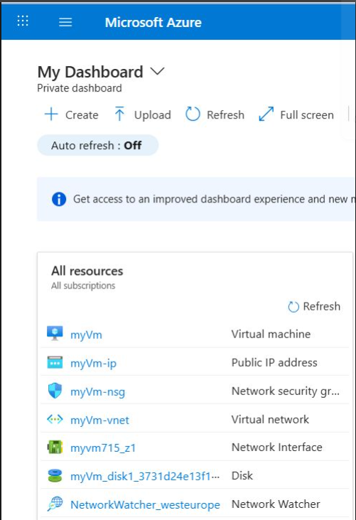
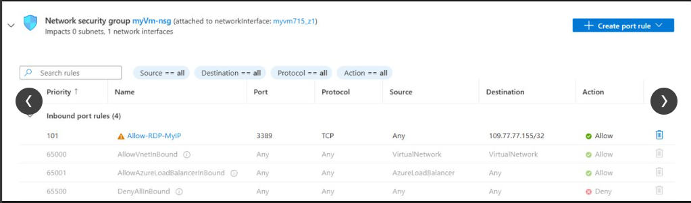
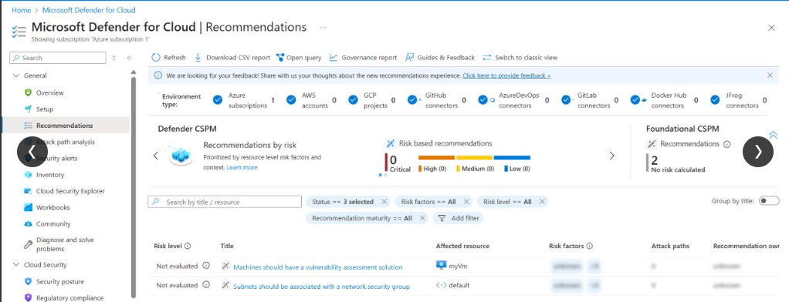

# Secure Azure Virtual Machine with NSG, RBAC and Defender

## Overview
As part of my Azure and Cloud Security learning, I deployed and secured a virtual machine using Azure Free Tier resources.

## Objectives
- Deploy Azure Virtual Machine
- Restrict network access using Network Security Groups
- Apply least privilege using RBAC
- Review security posture using Microsoft Defender for Cloud

## Steps Completed

### VM Deployment
Created a Windows/Linux VM in Azure within a dedicated resource group.

### Network Security
Configured NSG rule allowing inbound access only from my public IP.

### Identity & Access Management
Created test user and assigned Reader role only.

### Security Monitoring
Enabled Microsoft Defender for Cloud and reviewed recommendations.

## Key Learnings
- Restrict VM exposure to the internet.
- Apply least privilege through RBAC.
- Defender for Cloud helps identify security gaps quickly.

## Evidence

### VM Deployment

### NSG Rule

### RBAC Reader Role

### Defender Recommendations

